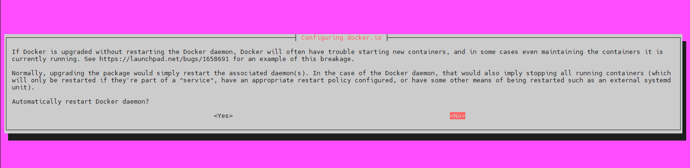
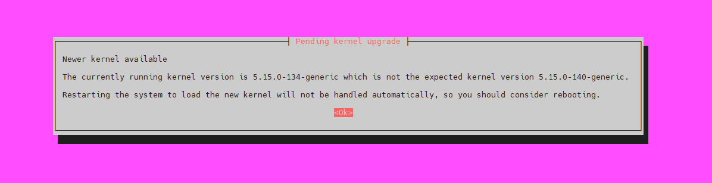

# 🚀 Деплой Python-скрипта на сервер Linux для новичков

Этот гайд поможет вам пошагово развернуть и запустить Python-бота (или любой другой скрипт) на сервере под управлением Linux. Подходит даже для тех, кто только начинает.

---

## 📁 1. Подготовка проекта и установка зависимостей

### 1.1 Создаём папку проекта и переходим в неё

```bash
mkdir mybot && cd mybot
```

---

### 1.2 Обновляем систему

```bash
sudo apt update && sudo apt upgrade -y
```
> Если появится такой экран
> 


> 💡 Здесь нас просят перезагрузить Docker.

✅ Рекомендуется выбрать "Yes" (Да) , если:
- У вас нет критически важных контейнеров, которые работают прямо сейчас.
- Контейнеры не являются частью какого-либо сервиса или не настроены с политикой перезапуска (restart policy).
- Вы хотите избежать ошибок, связанных с обновлением Docker без перезапуска демона (как описано в https://launchpad.net/bugs/1658691 ).

> Если появится такой экран
> 

> 💡 Это сообщение о необходимости перезагрузки системы после установки нового ядра (kernel) в Linux.

✅ Смело жмем 'ENTER'

> Если появится такой экран
> 

> 💡 Это сообщение появляется в системах Linux (особенно на дистрибутивах, основанных на Debian/Ubuntu) после обновления системных библиотек (например, через apt upgrade).

✅ С помощью 'TAB' перескакиеваем на 'OK' и жмем 'ENTER'

Теперь нам надо перезагруить сервер после обновления.
```bash
sudo reboot
```

После перезагрузки заходим обратно в нашу директорию для бота

```bash
cd mybot
```


---

### 1.3 Устанавливаем Python и инструменты

```bash
sudo apt install python3 python3-pip python3-venv -y
```

---

## 🐍 2. Создание виртуального окружения

### 2.1 Создаём и активируем окружение

```bash
python3 -m venv venv && source venv/bin/activate
```

> ✅ После активации командная строка начнётся с `(venv)`
---

### 2.1.1 Перекидываем все файлы проекта в нашу директорию кроме папки .venv

---

### 2.2 Установка зависимостей проекта

Если у вас есть `requirements.txt`:

```bash
pip install -r requirements.txt
```

Или устанавливайте вручную:

```bash
pip install aiogram
pip install asyncio
...
```

---

### 2.3 Проверка скрипта вручную

```bash
python main.py
```
> 🔍 Убедитесь, что скрипт работает корректно.

Если не отработало, попробуй так:

```bash
python3 main.py
```


---

## ⚙️ 3. Настройка systemd-сервиса

### 3.1 Создаём unit-файл сервиса

```bash
sudo nano <name>.service
```
> 💡 Вместо <name> придумай имя для сервиса, которй будет перезапускть твоего бота.

Вставьте в файл:

```ini
[Unit]
Description=<имя, котрое пидумал>
After=multi-user.target

[Service]
Type=simple
ExecStart=/root/<созданная директория>/venv/bin/python /root/<созданная директория>/main.py
WorkingDirectory=/root/<созданная директория>/
Restart=always
Environment="PYTHONUNBUFFERED=1"
StandardOutput=journal
StandardError=journal

[Install]
WantedBy=multi-user.target
```

> 🛡 Когда закончишь редактирование, давай сохраним файл. Жми по очереди CTRL + X, Y, ENTER!

---

### 3.2 Активация сервиса
выполняем команды по очереди
```bash
sudo cp <имя, котрое пидумал>.service /etc/systemd/system
sudo systemctl enable mybot.service
sudo systemctl start mybot.service
```

---

### 3.3 Проверка статуса

```bash
sudo systemctl status mybot.service
```

> ✅ В статусе должно быть `active (running)`

---

## 🔧 4. Управление сервисом

| Команда                                   | Описание                     |
|------------------------------------------|------------------------------|
| `sudo systemctl start mybot.service`     | Запустить сервис            |
| `sudo systemctl stop mybot.service`      | Остановить сервис           |
| `sudo systemctl restart mybot.service`   | Перезапустить               |
| `sudo systemctl status mybot.service`    | Проверить статус            |
| `sudo systemctl enable mybot.service`    | Добавить в автозагрузку     |
| `sudo systemctl disable mybot.service`   | Удалить из автозагрузки     |
| `sudo journalctl -u mybot.service -f`    | Смотреть логи в реальном времени |

---

## 🔐 5. Рекомендации по безопасности

- **Не запускайте сервис от root!**  
  Используйте отдельного пользователя без пароля (например, `mybotuser`).
  
- **Права доступа:**  
  ```bash
  sudo chown -R myuser:myuser ~/mybot
  ```

- **Логи сохраняйте в journal или в файл:**  
  В `mybot.service` можно заменить:  
  ```ini
  StandardOutput=append:/var/log/mybot.log
  ```

- **Проверяйте состояние:**  
  ```bash
  sudo systemctl status mybot.service
  sudo journalctl -u mybot.service --since today
  ```

---

## ✅ Заключение

Теперь ваш бот:

- изолирован в виртуальном окружении;
- автоматически запускается при старте системы;
- перезапускается при сбоях;
- может перезапускаться по расписанию.

Вы можете легко контролировать его с помощью `systemctl` и `journalctl`.

---
